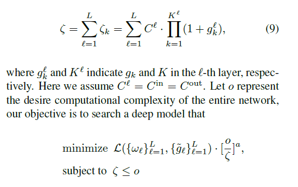

# G-ResNeXt_GroupNet_DGConv
This repository reproduces the results of the following paper:
[**Differentiable Learning-to-Group Channels via Groupable Convolutional Neural Networks**](https://arxiv.org/abs/1908.05867v1)
re-implement of Group ConvNet, also be called as G-ResNext. It's from the paper, reproduction of the paper "Differentiable Learning-to-Group Channels via Groupable Convolutional Neural Networks".
The architecture is the same as G-ResNeXt in table 1 of the paper. I just re-implemented the GroupNet bu using dynamic grouping convolution (DGConv) operation.

# Now, i have construct the loss function which considering the complexity of group conv DGConv.

The total complexity of DGConv layers has been added to the loss function. 
# Guideline for train the G-ResNeXt-50, 101 on ImageNet.
* Just change the ImageNet data path, change the GPU ID for fast reproducing of the GroupConvNet.
* PyTorch 0.4.0+, 1.0 is ok.
* Pretrained weights can be downloaded from BaiduYunPan (Baidu drive).

# Pre-trained weights
Baidu Wangpan: [G-ResNeXt](https://pan.baidu.com/s/1X6qlvArdNsjpjnCV6zrnPA) password:c0o6 .

For Chinese friends. 
链接：https://pan.baidu.com/s/1X6qlvArdNsjpjnCV6zrnPA 
提取码：c0o6 
